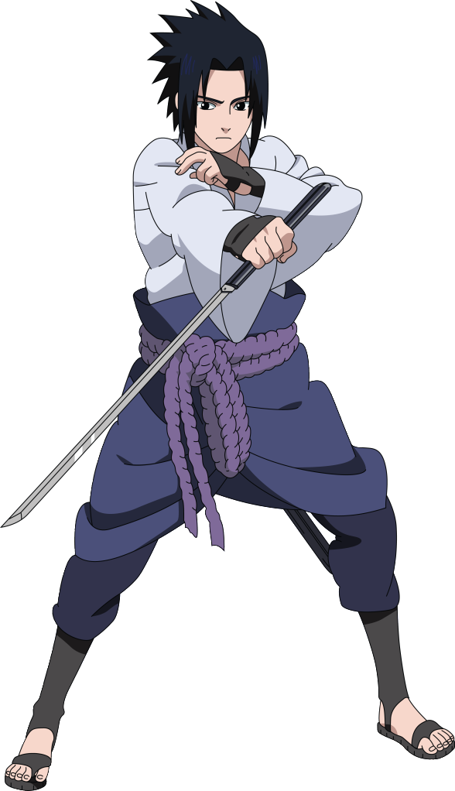

<td align="center" width="33%">



### ⚡ Sasuke Uchiha  
`S-RANK`

🌑 Status: Rogue  
⚡ Nature: Lightning  

</td>

</tr>
</table>

</p>

---

## 🧩 Project Structure


📦 shinobi-select
┣ 📂 img
┃ ┣ reningan.png
┃ ┗ sasuke.png
┣ 📂 audio
┃ ┣ madara.mp3
┃ ┣ naruto.mp3
┃ ┗ sasuke.mp3
┣ 📄 index.html
┗ 📄 README.md


---

## ⚙️ How It Works

- Characters stored in a **JS array**
- Button triggers:
  - Exit animation
  - Data swap
  - Voice playback
  - Entry animation

---

## 🧪 Character Config Example

```js
{
  name: "MADARA<br>UCHIHA",
  t1: "MADARA",
  t2: "UCHIHA",
  t3: "SHIPPUDEN",
  desc: "Wake up to reality!",
  img: "image-link",
  bg: "#a30000",
  voice: "audio/madara.mp3",
  stats: {
    village: "UCHIHA",
    power: "GOD",
    nature: "FIRE"
  }
}
🚀 Setup
git clone https://github.com/your-username/shinobi-select.git
cd shinobi-select
open index.html
🌌 Future Upgrades
🎮 Keyboard navigation
🌐 React version
💾 Save user selection
🎵 Background soundtrack
🧊 Glassmorphism UI
👨‍💻 Author

Your Name

📜 License

Open-source & free to use

<p align="center"> 🔥 <i>"Wake up to reality! Nothing ever goes as planned..."</i> </p> ```